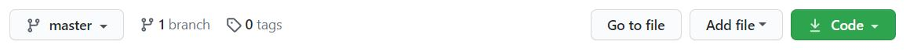

# CRUD operations in the backend

The code is taken from [this](https://github.com/iamshaunjp/node-js-playlist) repository by [iamshaunjp](https://github.com/iamshaunjp). Practiced from his [youtube_series](https://www.youtube.com/watch?v=w-7RQ46RgxU&list=PL4cUxeGkcC9gcy9lrvMJ75z9maRw4byYp) on nodejs tutorial for beginners.


## Dependancies used

- [**express**](https://www.npmjs.com/package/express)
This middleware provides us with fewer lines of code that is easier to understand compared to pure nodejs code for routing, caching, redirecting and provides us with MVC method to arrange our code systematically

- [**mongoose**](https://www.npmjs.com/package/mongoose)
This helps connect mongoDB with our nodejs application

- [**body-parser**](https://www.npmjs.com/package/body-parser)
This is a nodejs middleware for handling JSON, Raw, Text and URL encoded form data. Parse incoming request bodies in a middleware before your handlers, available under the req.body property

- [**nodemon**](https://www.npmjs.com/package/nodemon)
It is a tool that helps develop node.js based applications automatically restart when file changes in the directory are detected


## Flow of the code

- [**app.js**](./app.js)
  - require all the packages to be used
  - set express app
  - connect to mongDB using mongoose
  - call all the middlewares you will be using in your application i.e. body-parser(installed package), route-middleware(wrote code in [**ninja.routes.js**](./ninja.routes.js))
  - listen to the port

- [**ninja.model.js**](./ninja.model.js) : 
here the data structure (aka. Schema) to be stored in our mongoDB is defined using mongoose. Model is created and exported using the Schema defined.

- [**ninja.routes.js**](./ninja.routes.js) :
Using express and the model we created in [**ninja.model.js**](./ninja.model.js) we create routes.


## Basic CRUD operations
One can test these CRUD operations on POSTMAN. 

```
Create, Read, Update, Delete 
post, get, put, delete
```

The following are the routes created by this application.

- [**GET**](./ninja.routes.js#L6) <br/>
http://localhost:4000/api/ninjas <br/>
to get all the ninjas from database

- [**GET**](./ninja.routes.js#L15) <br/>
http://localhost:4000/api/ninjas?lng=13.7&lat=45.3 <br/>
to get the ninjas near the given lng and lat from the database

- [**POST**](./ninja.routes.js#L33) <br/>
http://localhost:4000/api/ninjas <br/>
to get add new ninja from the database

- [**PUT**](./ninja.routes.js#L50) <br/>
http://localhost:4000/api/ninjas/:id <br/>
to update details of ninja with the given id(in the parameters) from the database

- [**DELETE**](./ninja.routes.js#L64) <br/>
http://localhost:4000/api/ninjas <br/>
to delete a ninja of the given id from the database


## How to start the code on local machine

- Click on the green code button as shown below


- Download then extract the zip file

- Open the folder in VS Code or any of you favorite IDE

- Open terminal, (VS code has built in terminal) and write ```npm install``` or ```npm i```, this will install all the node packages mentioned in package.json file

- To start the application write ```npm start``` in your terminal


